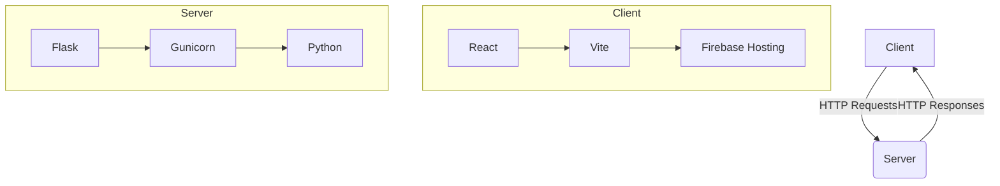

# EcoVibe (ECK)

Welcome to EcoVibe, a web application designed to promote eco-friendly living and sustainable practices. This repository contains the source code for both the client-side and server-side applications.

## Project Overview

EcoVibe is a platform that encourages users to adopt a more environmentally conscious lifestyle. It provides information, resources, and a community space for individuals who are passionate about sustainability.

## Project Diagram



## Folder Structure

```
/
├── client/
│   ├── src/            # Contains the client-side source code.
│   │   ├── components/ # Contains the React components.
│   │   ├── css/        # Contains the CSS files.
│   │   ├── hooks/      # Contains the custom React hooks.
│   │   └── utils/      # Contains the utility functions.
│   ├── tests/          # Contains the client-side tests.
│   └── public/         # Contains the public assets.
├── server/
│   ├── models/         # Contains the database models.
│   ├── routes/         # Contains the API routes.
│   └── tests/          # Contains the server-side tests.
├── .github/            # Contains the GitHub Actions workflows.
│   └── workflows/
└── scripts/            # Contains the utility scripts.
```

## Workflow Approach

This project follows a standard Git workflow. All contributions should be made through pull requests.

1.  **Fork the repository:** Create a personal fork of the project on GitHub.
2.  **Clone the fork:** Clone your fork to your local machine.
3.  **Create a new branch:** Create a new branch for your changes.
4.  **Make your changes:** Implement your feature or bug fix.
5.  **Commit your changes:** Commit your changes with a clear and descriptive commit message.
6.  **Push to your fork:** Push your changes to your fork on GitHub.
7.  **Create a pull request:** Create a pull request from your fork to the main repository.

For more details, please see our [Contributing Guide](CONTRIBUTING.md).

## Tools Used

### Client

*   **Framework:** [React](https://reactjs.org/)
*   **Build Tool:** [Vite](https://vitejs.dev/)
*   **Styling:** [Bootstrap](https://getbootstrap.com/), [React-Bootstrap](https://react-bootstrap.github.io/), [MUI Icons](https://mui.com/material-ui/material-icons/)
*   **Testing:** [Vitest](https://vitest.dev/), [React Testing Library](https://testing-library.com/docs/react-testing-library/intro/)
*   **Deployment:** [Firebase Hosting](https://firebase.google.com/docs/hosting)

### Server

*   **Framework:** [Flask](https://flask.palletsprojects.com/)
*   **WSGI Server:** [Gunicorn](https://gunicorn.org/)
*   **Dependency Management:** [Pipenv](https://pipenv.pypa.io/)
*   **Testing:** [Pytest](https://docs.pytest.org/)

## Setup Instructions

### Client

1.  **Navigate to the client directory:**

    ```bash
    cd client
    ```

2.  **Install dependencies:**

    ```bash
    npm install
    ```

3.  **Run the development server:**

    ```bash
    npm run dev
    ```

4.  **Run tests:**

    ```bash
    npm run test
    ```

### Server

1.  **Navigate to the server directory:**

    ```bash
    cd server
    ```

2.  **Install dependencies using Pipenv:**

    ```bash
    pipenv install --dev
    ```

3.  **Activate the virtual environment:**

    ```bash
    pipenv shell
    ```

4.  **Run the development server:**

    ```bash
    flask run
    ```

5.  **Run tests:**

    ```bash
    pytest
    ```

## Environment Variables

### Client-Side

For the client-side application to connect to Firebase, you will need to create a `.env` file in the `client` directory.

1.  Create a new file named `.env` in the `client` directory.
2.  Add the following line to the `.env` file, replacing `your-firebase-api-key` with your actual Firebase API key:

    ```
    VITE_FIREBASE_API_KEY=your-firebase-api-key
    ```

### Server-Side

The server-side application uses Flask's prefixed environment variables. The recommended way to manage these is with a `.flaskenv` file in the `server` directory.

1.  Create a new file named `.flaskenv` in the `server` directory.
2.  Add your configuration variables to this file, prefixed with `FLASK_`. For example, to run the application in debug mode, you would add:

    ```
    FLASK_DEBUG=1
    ```

    Any other configuration your app needs should be added here as well.

## Makefile Usage

This project includes a `Makefile` to streamline common development tasks.

### Operating System Compatibility

- **macOS:** Fully compatible.
- **Linux:** Fully compatible.
- **WSL (Windows Subsystem for Linux):** Fully compatible.
- **Windows (without WSL):** Requires a bash-like environment (e.g., Git Bash) for the `propose` command. The `help` command will work in the standard Windows Command Prompt or PowerShell.

### Available Commands

#### `make help`

Displays a list of available commands and their usage.

#### `make propose m="<commit-message>"`

This command automates the process of preparing your code for a pull request. It performs the following steps:

1.  **Validates Input**: Checks that you've provided a commit message.
2.  **Branch Check**: Ensures you are not on the `main` or `develop` branch.
3.  **Backend Linting & Formatting**:
    - Formats Python code in the `server/` directory using `black`.
    - Lints Python code with `flake8` to catch errors and style issues.
4.  **Frontend Linting & Formatting**:
    - Formats JavaScript/React code in the `client/` directory using `prettier`.
    - Lints and fixes issues in the frontend code with `eslint`.
5.  **Commits Changes**:
    - Stages all modified files (`git add .`).
    - Commits the changes with your provided message.
6.  **Syncs with Remote**: Pulls the latest changes from the `develop` branch to keep your branch up-to-date.
7.  **Pushes to GitHub**: Pushes your feature branch to the remote repository.
8.  **Next Steps**: Reminds you to create a pull request on GitHub.

### Example

To propose a new feature, you would run:

```bash
make propose m="feat: implement user authentication"
```

## GitHub Actions

This project uses GitHub Actions to automate testing, linting, and deployment. Here is an overview of the workflows:

### Client Workflows

- **`Client Merge PR/Push CI` (`client-merge.yaml`)**: Triggered on pushes to `main` and `develop`. Runs the full client-side test suite against multiple Node.js versions to ensure compatibility.

- **`Client Pull Request CI` (`client-pull-request.yml`)**: Triggered on pull requests to `main` and `develop`. This workflow runs the client-side tests, calculates test coverage, and posts a summary on the pull request. It will fail the check if the coverage drops below a predefined threshold, ensuring code quality is maintained.

### Server Workflows

- **`Flask application CI` (`server.yaml`)**: Triggered on pushes and pull requests to `main` and `develop`. It runs the server-side Python tests against multiple Python versions. It also calculates test coverage and adds a report to the pull request, highlighting coverage for only the changed files.

### Deployment Workflows

- **`Deploy to Firebase Hosting on merge` (`firebase-hosting-merge.yml`)**: Automatically deploys the client application to the live Firebase Hosting environment when code is merged into the `main` branch.

- **`Deploy to Firebase Hosting on PR` (`firebase-hosting-pull-request.yml`)**: When a pull request is opened against `main` or `develop`, this workflow builds the client application and deploys it to a temporary preview URL. This allows for reviewing the changes in a live-like environment before they are merged.

### Code Quality Workflow

- **`MegaLinter` (`megalinter.yaml`)**: This workflow runs on every pull request to `main` and `develop`. It uses MegaLinter, a powerful tool that bundles many linters, to analyze the entire codebase for style issues, potential bugs, and inconsistencies. It is configured to automatically fix many of the issues it finds and commit them directly to the pull request branch, helping to maintain a clean and consistent codebase.
